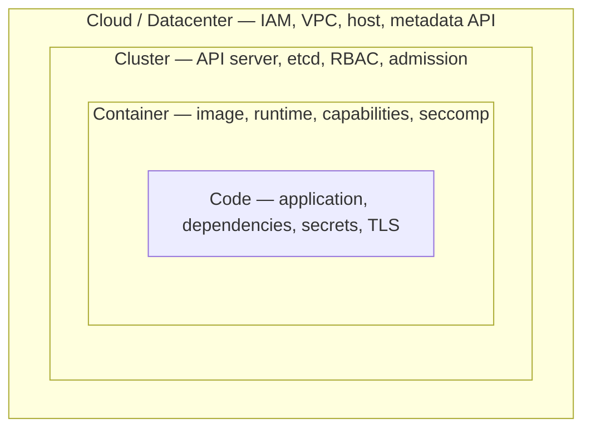
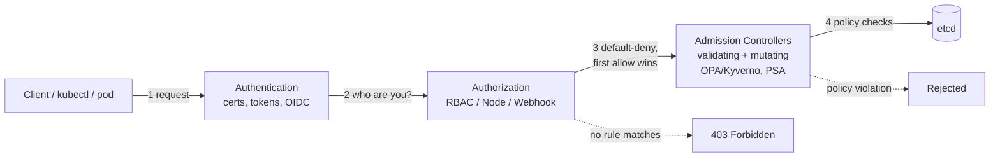
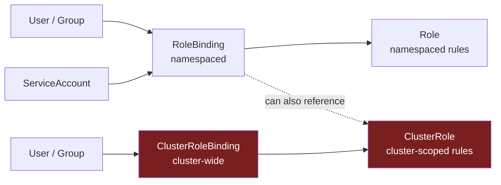
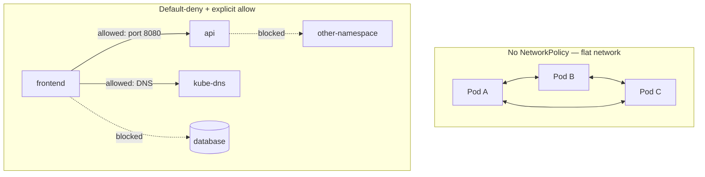
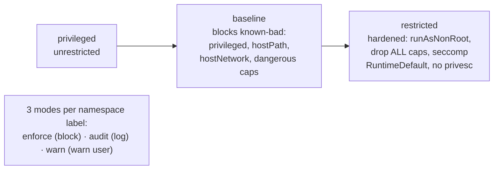

# Kubernetes & Container Security Documentation


A personal, curated reference on **Kubernetes, Docker, and Linux security** — written
while studying for CKS/CKA and hardening real container platforms. It is a **knowledge
base of study notes**, not a tool, product, or piece of production software. That's the
honest framing, and it's also why it's useful: ~150 topic write-ups, each following a
consistent structure (concept → risks/attacks → hardening → compliance mapping → lab),
plus reusable audit scripts, YAML examples, cheatsheets, and a glossary.

> **Read this first if you're new here:** everything lives under [`k8-security/`](k8-security/).
> This root file is the map; [`k8-security/README.md`](k8-security/README.md) and
> [`k8-security/CURRICULUM.md`](k8-security/CURRICULUM.md) are the full table of contents.

---

## Why this exists

Container and Kubernetes security spans four different layers — Linux kernel primitives,
the container runtime, the Kubernetes control plane, and application/workload config —
and most write-ups treat them separately. This repo works bottom-up on purpose:

```
Linux Security  →  Docker Security  →  Kubernetes Security  →  Kubernetes Concepts (official-docs-aligned)
(kernel/OS)        (runtime, applies    (orchestration on top   (companion tree covering the full
                     Linux primitives)    of runtime + kernel)    docs concept map through a security lens)
```

Each topic is written to answer the same questions: what it is, why it exists, what can
go wrong, how to attack it, how to detect and harden it, how it maps to compliance
frameworks (CIS, PCI DSS, ISO 27001, SOC 2, NIST, HIPAA), and how to talk about it in an
interview.

---

## Repository layout

```
kubernetes-security-documentation/
└── k8-security/
    ├── README.md                 ← entry point / track overview
    ├── CURRICULUM.md             ← full syllabus: every module, order, timeline
    ├── _templates/                ← the lesson structure every module follows
    ├── resources/                 ← compliance matrix, tooling index, glossary,
    │                                 interview question bank, command cheatsheet
    ├── scripts/                   ← reusable audit/hardening shell scripts
    ├── labs/                      ← shared lab bootstrap (kind/minikube) + safety rules
    │
    ├── linux-security/            ← Track 1 — 17 modules (permissions → forensics)
    ├── docker-security/           ← Track 2 — 15 modules (architecture → incident response)
    ├── kubernetes-security/       ← Track 3 — 26 modules (control plane → compliance)
    └── kubernetes-concepts/       ← Track 4 — 61 topics mirroring the official K8s docs
        (Security · Policies · Scheduling · Cluster Admin · Observability · Windows · Extending)
```

Every module folder follows the same pattern: `README.md` (the lesson), `examples/`
(runnable YAML/Dockerfiles/scripts), `labs/lab.md` (hands-on steps). This layout is
already consistent and deliberately structured, so this pass focused on adding
navigation and framing rather than moving files around.

---

## Navigate by track

| Track | Modules | What it covers | Start here |
|---|:---:|---|---|
| [Linux Security](k8-security/linux-security/) | 17 | DAC/ACLs, PAM, SSH, sudo, MFA, SELinux/AppArmor, kernel hardening, LUKS, firewalls, auditd, TLS/PKI, CIS/STIG, forensics | [01 — Permissions](k8-security/linux-security/01-permissions-acls-suid-sgid-sticky/) |
| [Docker Security](k8-security/docker-security/) | 15 | Architecture, namespaces, cgroups, containerd/runc, rootless, daemon/socket security, Dockerfile hardening, distroless, image scanning, secrets, runtime hardening, supply chain | [01 — Docker Architecture](k8-security/docker-security/01-docker-architecture/) |
| [Kubernetes Security](k8-security/kubernetes-security/) | 26 | Control plane & node security, authN/RBAC, admission control, Pod Security Admission, seccomp/AppArmor/SELinux, capabilities, secrets & encryption, network policy, mTLS, image signing/SBOM, Falco/eBPF, audit logging, CIS/NSA hardening, multi-tenancy, DR, compliance, IR | [01 — Control Plane Security](k8-security/kubernetes-security/01-control-plane-security/) |
| [Kubernetes Concepts](k8-security/kubernetes-concepts/) | 61 | Official-docs concept tree — Security, Policies, Scheduling/Preemption/Eviction, Cluster Administration, Observability, Windows, Extending Kubernetes — each cross-linked to the deep-dive module above where one exists | [Concepts index](k8-security/kubernetes-concepts/README.md) |

Also useful on their own:
[Compliance matrix](k8-security/resources/compliance-matrix.md) ·
[Tooling index](k8-security/resources/tooling-index.md) ·
[Glossary](k8-security/resources/glossary.md) ·
[Interview question bank](k8-security/resources/interview-question-bank.md) ·
[Command cheatsheet](k8-security/resources/cheatsheet-commands.md) ·
[Reusable audit/hardening scripts](k8-security/scripts/)

---

## A few of the concepts covered, visualized

These diagrams summarize concepts already written up in the notes — they're navigation
aids, not new claims. See the linked module for the full explanation.

### The 4 C's of cloud-native security
Described in [`kubernetes-security/README.md`](k8-security/kubernetes-security/README.md) —
a weakness at an outer layer defeats hardening at an inner one.



### Kubernetes API request path (authN → authZ → admission)
Described in [`kubernetes-security/01-control-plane-security`](k8-security/kubernetes-security/01-control-plane-security/)
and [`04-authorization-rbac`](k8-security/kubernetes-security/04-authorization-rbac/).



### RBAC binding model
Described in [`kubernetes-security/04-authorization-rbac`](k8-security/kubernetes-security/04-authorization-rbac/)
— the repo's most fully-developed module.


Dangerous combination: `ClusterRoleBinding` + `cluster-admin` (or wildcard rules) bound to
a `ServiceAccount` — a single compromised pod becomes a full cluster takeover.

### NetworkPolicy default-deny model
Described in [`kubernetes-security/15-network-policies`](k8-security/kubernetes-security/15-network-policies/).


Enforcement requires a policy-aware CNI (Calico, Cilium) — the `NetworkPolicy` object does
nothing on a CNI that ignores it.

### Pod Security Admission levels
Described in [`kubernetes-security/06-pod-security-admission`](k8-security/kubernetes-security/06-pod-security-admission/).



---

## Status & roadmap

Honest state of the content, based on reading through it:

- **Fully-developed "flagship" lessons** exist for three modules and run the complete
  20-point lesson format end-to-end (300+ lines each, including quiz, interview
  questions at three levels, and a production incident scenario):
  [Linux 01 — Permissions](k8-security/linux-security/01-permissions-acls-suid-sgid-sticky/),
  [Docker 01 — Architecture](k8-security/docker-security/01-docker-architecture/), and
  [Kubernetes Security 04 — Authorization & RBAC](k8-security/kubernetes-security/04-authorization-rbac/).
- **The remaining ~145 topic modules** (across all four tracks) use a **condensed
  reference format** — the same headings (concept, risks/attacks, best practices,
  hardening, compliance mapping, lab/quiz/interview pointers), compressed to ~30 lines
  instead of the full expanded treatment. They are accurate and usable as quick
  references, not underdeveloped stubs — but they are noticeably shorter than the three
  flagship lessons.
- **Kubernetes Concepts (Track 4)** is written entirely in this condensed style by
  design — it mirrors the official Kubernetes docs concept tree rather than going as
  deep as the dedicated Kubernetes Security track.
- No `LICENSE` file exists yet. Since this is published on GitHub, the author should
  add one (even a permissive one) so it's clear how others may reuse the material.
- No root-level `README.md` existed before this pass — the repository landing page was
  effectively empty; this file fills that gap.

### Recommendations / content gaps for the author to consider
1. Pick 3–5 more high-traffic modules (candidates: Docker 09 Image Scanning, K8s 06 Pod
   Security Admission, K8s 15 Network Policies, K8s 19 Falco/eBPF, K8s 21 CIS/NSA
   Hardening) and expand them to the full flagship format — these are the topics most
   likely to come up in interviews or be linked to directly.
2. Add a short top-level license and a one-line contribution/usage note if this is meant
   to be referenced or reused by others.
3. Consider a `CHANGELOG.md` or simply dated commits going forward — the current single
   `"Documentations"` commit makes it hard to see how the curriculum evolved.
4. The `labs/` bootstrap assumes Ubuntu/Debian and a Linux host; a short note on running
   the same labs from Windows (WSL2) or macOS would widen who can actually follow along.

---

## Safety note

Several modules include real attack demonstrations (container escapes, privilege
escalation, credential theft). They are for **authorized, isolated-lab use only** — see
[`k8-security/labs/SAFETY.md`](k8-security/labs/SAFETY.md) before running anything from
`examples/` or `labs/` against a real system.
